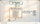

# Claw Relay

Trust layer between AI agents and [agent-browser](https://github.com/anthropics/agent-browser) — the Rust CLI for browser automation.

A WebSocket relay server + Chrome extension that lets AI agents safely control a user's real browser with auth, permissions, audit logging, and site access control.

## Architecture



## Quick Start

### Relay Server

```bash
cd relay-server
npm install
cp config.example.yaml config.yaml  # edit with your agent tokens
npm run build
npm start
# or: npm run dev
```

### Chrome Extension

1. Open `chrome://extensions`
2. Enable "Developer mode"
3. Click "Load unpacked" → select the `extension/` directory
4. Click the Claw Relay icon to toggle status

### Test

```bash
# Start the relay server first, then:
cd relay-server
npx ts-node test.ts
```

## WebSocket Protocol

Connect to `ws://localhost:9222` (configurable).

**Auth:** First message must be:
```json
{"type": "auth", "token": "your-token", "agent_id": "your-agent"}
```

**Actions:**
```json
{"type": "snapshot"}
{"type": "click", "ref": "@e5"}
{"type": "fill", "ref": "@e3", "text": "hello"}
{"type": "navigate", "url": "https://example.com"}
{"type": "screenshot"}
{"type": "evaluate", "js": "document.title"}
{"type": "press", "key": "Enter"}
{"type": "hover", "ref": "@e2"}
{"type": "select", "ref": "@e7", "values": ["option1"]}
{"type": "type", "ref": "@e3", "text": "hello"}
{"type": "close"}
```

## Configuration

See `relay-server/config.example.yaml` for full config reference.

**Scopes:** `read`, `interact`, `navigate`, `execute` (highest risk)

**Allowlist/Blocklist:** Glob patterns supported (`*.cloudflare.com`). Global blocklist always wins.

## Security

- Token-based agent authentication
- Per-agent scope restrictions (read/interact/navigate/execute)
- Site allowlist per agent + global blocklist
- Token bucket rate limiting per agent
- Append-only JSONL audit log of every action
