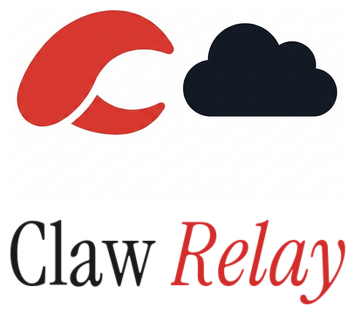

<p align="center">
  
</p>

# Claw Relay

Give your AI agents a real browser.

## Quick Start

```bash
npx claw-relay
```

> **Note:** Not yet published to npm. For now, clone the repo and run `./start.sh`.

Launches a dedicated Chrome window, starts the relay, generates config with random tokens. One command, zero setup.

**First time:** Sign into GitHub (or any site) in the Claw Relay Chrome window. Logins persist between restarts.

**Restart:** `Ctrl+C` stops the relay. Chrome stays open. Run `npx claw-relay` again — it reconnects without relaunching Chrome.

## What It Does

Claw Relay sits between your AI agent and Chrome. The agent sends actions (navigate, click, read) via WebSocket — the relay enforces auth, permissions, rate limits, and site restrictions before forwarding to Chrome via CDP.

### Capabilities

- **Navigation & snapshots** — browse pages, read accessibility trees
- **Element interaction** — click, type, fill, hover, select, drag & drop
- **Screenshots** — full page, viewport, or individual elements
- **Batch actions** — execute multiple actions in a single message
- **Tab targeting** — pin actions to specific tabs via `targetId`
- **Wait conditions** — wait for text, selectors, navigation, network idle, or custom JS
- **Console & network monitoring** — capture logs and requests
- **PDF generation** — render pages to PDF
- **Viewport resize** — test responsive layouts
- **JavaScript evaluation** — run arbitrary code in page context

## Connect Your Agent

Works with **Copilot CLI**, **OpenClaw**, **Claude Code**, **nanobot**, **ZeroClaw**, or any MCP client.

### MCP (Copilot CLI, Claude Code, any MCP client)

```json
{
  "mcpServers": {
    "claw-relay": {
      "command": "node",
      "args": ["mcp/claw-relay-mcp.js"],
      "env": {
        "CLAW_RELAY_URL": "ws://localhost:9333",
        "CLAW_RELAY_TOKEN": "your-token",
        "CLAW_RELAY_AGENT": "default"
      }
    }
  }
}
```

### OpenClaw Skill (OpenClaw, nanobot, ZeroClaw)

Use the bundled CLI client — no MCP required:

```bash
export CLAW_RELAY_URL="ws://localhost:9333"
export CLAW_RELAY_TOKEN="your-token"
export CLAW_RELAY_AGENT="your-agent"

node skills/openclaw/relay-client.cjs navigate https://github.com
node skills/openclaw/relay-client.cjs snapshot
node skills/openclaw/relay-client.cjs click e3
```

See [`skills/openclaw/SKILL.md`](skills/openclaw/SKILL.md) for the full agent skill reference.

### WebSocket (custom agents)

Connect directly via WebSocket for full control:

```javascript
const ws = new WebSocket('ws://localhost:9333');
ws.send(JSON.stringify({ type: 'auth', token: 'your-token', agent_id: 'your-agent' }));
```

See [protocol docs](docs/protocol.md) for the full action reference.

See [MCP docs](docs/mcp.md) for MCP-specific setup.

## Chrome Extension

Optional — lets your agent use your normal Chrome instead of the dedicated window:

1. `chrome://extensions` → Developer mode → Load unpacked → select `extension/`
2. Click the toolbar icon on any tab to share it with the relay

## Configuration

Auto-generated `config.yaml` on first run. Or copy the example manually:

```bash
cp relay-server/config.example.yaml relay-server/config.yaml
```

Key settings:

```yaml
agents:
  my-agent:
    token: "crly_..."           # auth token
    scopes: ["read", "navigate", "interact"]
    allowlist: ["github.com"]   # where the agent can go
    rateLimit: 30               # actions per minute

blocklist:
  - "*.bank.com"               # always blocked
```

## CLI Options

```
npx claw-relay [options]

  --port <number>    Server port (default: 9333)
  --config <path>    Custom config path
  --no-chrome        Skip Chrome launch (assumes CDP on :9222)
```

## Security

- **Auth** — token + agent ID per connection
- **Scopes** — read, navigate, interact, execute
- **Allowlist/Blocklist** — per-agent URL restrictions
- **Rate limiting** — per agent, per minute
- **Audit log** — every action logged with timestamp

## First-Time Agent Setup

> **💡 Quickest setup with GitHub Copilot CLI:**
> ```bash
> copilot --additional-mcp-config '{"mcpServers":{"claw-relay":{"command":"node","args":["mcp/claw-relay-mcp.js"],"env":{"CLAW_RELAY_URL":"ws://localhost:9333","CLAW_RELAY_TOKEN":"your-token","CLAW_RELAY_AGENT":"your-agent-id"}}}}'
> ```
> That's it — Copilot CLI loads the MCP server and you're ready to browse. [Get Copilot CLI free →](https://docs.github.com/en/copilot/github-copilot-in-the-cli)

1. Add your agent to `config.yaml` with a token, scopes, and allowlist
2. Restart the relay (config is read at startup)
3. Connect using your platform's method (MCP or OpenClaw skill)
4. Test with a simple `snapshot` action

**Common gotchas:**

- **Agent ID is case-sensitive** — `Rusty` ≠ `rusty`. Match `config.yaml` exactly.
- **Restart after config changes** — the relay reads `config.yaml` at startup only
- **Check scopes** — if an action fails with "permission_denied", the agent needs that scope added
- **One action per call** (OpenClaw skill) — don't try to batch or keep connections open

## Docs

| | |
|---|---|
| [Setup Guide](docs/setup.md) | Install, configure, launch |
| [MCP Server](docs/mcp.md) | Connect MCP clients |
| [Protocol](docs/protocol.md) | WebSocket API reference |
| [Dashboard](docs/dashboard.md) | Web UI for monitoring |
| [Tunnels](docs/tunnels.md) | Remote access |
| [Troubleshooting](docs/troubleshooting.md) | Common issues |

## Built With

- [Node.js](https://nodejs.org) — runtime
- [Hono](https://hono.dev) — HTTP framework
- [Playwright](https://playwright.dev) — browser automation
- [Cloudflare Tunnels](https://developers.cloudflare.com/cloudflare-one/connections/connect-networks/) — secure remote access
- [TanStack Router](https://tanstack.com/router) — dashboard SPA

## License

MIT
